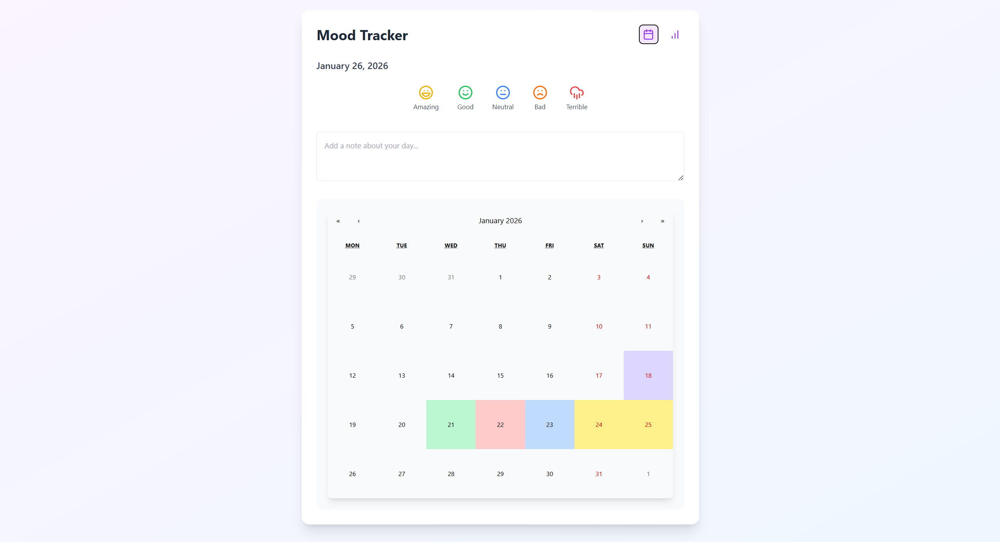
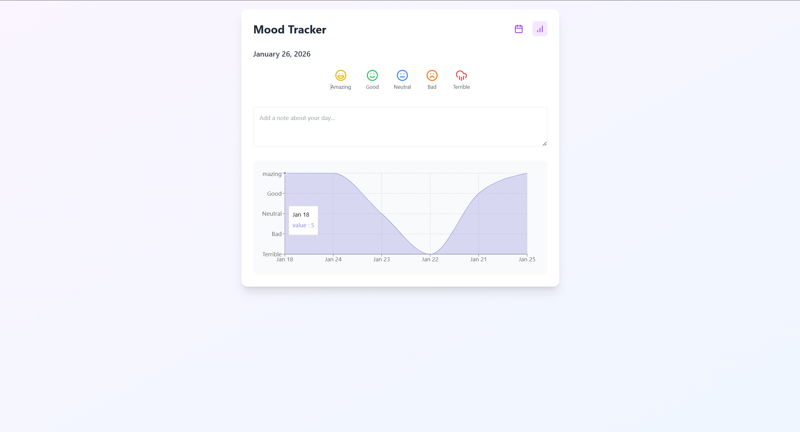

# Mood Analyser

A sleek, lightweight web application built with **Vite** that helps users track their emotional well-being over time. Visualize your daily moods through an interactive calendar and analyze long-term trends with data-driven insights.

---

## 📊 Project Preview

Stay on top of your mental health with our intuitive tracking interface:

|        Daily Tracking (Main)         |    Analytical Insights (Graph)    |
| :----------------------------------: | :-------------------------------: |
|  |  |
|     _Interactive Calendar View_      |       _Overall Mood Trends_       |

---

## ✨ Core Features

- **📅 Calendar Integration:** Mark your mood for each specific day with color-coded indicators.
- **📈 Trend Analysis:** View your overall emotional status through a dynamic graph.
- **⚡ Powered by Vite:** Experience lightning-fast Hot Module Replacement (HMR) and build times.
- **📱 Responsive UI:** Track your mood on the go, whether on mobile or desktop.

---

## 🛠️ Tech Stack

- **Bundler:** [Vite](https://vitejs.dev/)
- **Library:** React / Vue (Standard Vite Template)
- **Visualization:** Chart.js / Recharts (for the Mood Graph)
- **Styling:** Modern CSS / Tailwind CSS

---

## 🚀 Getting Started

To get a local copy up and running, follow these simple steps:

### Prerequisites

- npm
  ```bash
  npm install
  npm run dev
  ```
